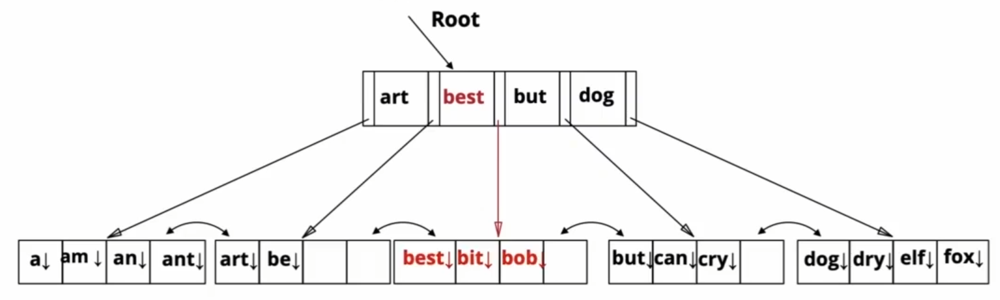

# B+ Trees
### Tree-Structure Indexes
* Tree-structure indexes support **range searches** and **equality searches**
	* ***ISAM***: static structure (old technology) in which the index is built just once, when the file is loaded
		* When pages become full, use overflow pages
		* The tree can bec oem very unbalanced
	* ***B+ Tree***: dynamic -- index is adjusted as records are inserted and deleted in the file. Index remains balanced.
		* B+ Trees are balanced*, meaning that the length of the path from the root to any leaf is the same.

### Structure of a B+ Tree
* For each entry $(k_i,p_i)$, all values in the subtree rooted at $p_i$ are greater than or equal to $k_i$
* This is used to guide search for $k$ - find the largest $(k_i,p_i)$ for which $k\leq k_i$ and search in the subtree rooted at $p_{i-1}$

### B+ Tree Properties
* Tree is *height balanced*
* Minimum of 50% occupancy (except for  root): Each node contains $d\leq m \leq 2d$ entries 
	* $d$ is called the **order** of the tree
* Supports equality and range searchers efficiently
* Highy fanout $F$ of index pages keeps the height of the tree small
* insert/delete at $O(\text{log}_FN)$
	* F = fanout (# of pointers to child nodes of a node in the tree), N = # leaf pages

### B+ Tree Insertions
We assume that inserttions are much more frequent than deletions.
1. Find correct leaf L (correct w.r.t the ordering)
	1. If L has enough space, done!
	1. Else, must split L into L and a new node L2
		1. Redistribute entries evenly, copy up middle key
		2. Insert index entry pointing to L2 into parent of L
	2. This can happen recursivelyt
		1. To split index node, redistrivute entries evenly, but push up middle key
	3. Splits "grow" the tree, root split increases hight