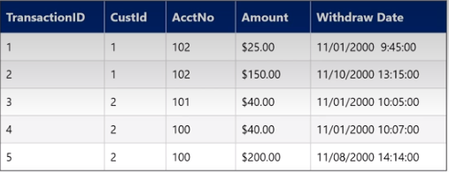
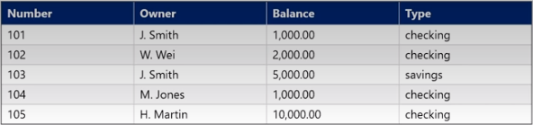

### Single Table Queries
The basic syntax of SQL is
```
SELECT [DISTINCT] {list of attributes}
FROM {list of relations}
WHERE {conditions}
```
We will start by considering a single relation in the FROM clause, using this relation, called `ATMWithdrawal`:

Consider this query:
```
SELECT AccountNo, Amount
FROM ATMWithdrawal
WHERE Amount < 50;
```
`SELECT` specifies the attributes to be returned from this operation
`FROM` specifies the relation that these attributes are from
`WHERE` specifies the logical operation to be performed on the specified relation
We can use `SELECT *` to select all of the attributes from the relation
Similarly, we can specify a different query that works on a different attributes with an `OR` statement on this relation called `Account`:

```
SELECT Owner AS PName
FROM Account
WHERE Type = 'checking' OR Balance < 6000;
```
We also rename the `Owner` attribute to `PName` using the `AS` keyword.
The relation returned in thi case has duplicate entries in its only atribute, `PName`. We can eliminate these in our returned relation using the `DISTINCT` keyword:
```
SELECT DISTINCT Owner AS PName
FROM Account
WHERE Type = 'checking' OR Balance < 6000;
```
In the event where the `WHERE` clase is always False, the resulting relation is empty, i.e. it contains 0 rows, and the query is called called *useless*. However, if there are cases where the query could return True, but that specific case is not in the current relation, the query is not useless. Usless is reserved for queries ehose `WHERE` clase will *always* return False.
Two queries that ALWAYS return the same result are called **equivalent**.

### Queries over Multiple Tables
This query is an example of one that operates over multiple tables:
```
SELECT A.Owner, A.Balance
FROM Account A, Deposit D
Where D.AccountNo = A.Number 
	AND A.Balance > 1000;
```
It is often easier to specifiy a shorthand for the multiple relations we are working with, as we do here, renaming `Account` to `A` and `Deposit` to `D`.
To check for the condition specified in the `WHERE` clause, `D.AccountNo = A.Number`, we have to check every combination of one row from `Account` with one row from `Deposit`. For each combination considered, we must also consider the `Balance` amount for each combination that succeeds in the first condition, and check if it is greater than `5000`. 
Finally, we keep the `Owner` and `Balance` from the `Account` table portion of the combination in the `SELECT` clause.

#### Joins
Using the `Deposit` relation's key `AcctNo` and the `Account` relation's foreign key `Number` we can perform the above relation using `JOIN..ON`:
```
SELECT A.Owner, A.Balance
FROM Account A JOIN Deposit D ON D.AccotNo = A.Number
WHERE A.Balance > 1000;
```
This improves readbility since the `JOIN` condition is not buried in the `WHERE` clause, and it also cues the optimizer to perform optimizations, as it is now aware that this query is a `JOIN`.
#
Notice that the answer to a query is always a table - i.e, the language is closed. We can use this to our advantage by breaking up complex queries into smaller parts by generating intermediate tables.
#### Temporary Tables
We can create temporary tables using the `INTO` keyword, as long as we have permission to write new tables from the DBA:
```
SELECT Number, Owner, Balance INTO temp3
FROM Account
WHERE Type = 'checking'
```
We can then use this new table called `temp3` in subsequent queries. **Remember to delete temporary tables!**, even though tenporary tables are dropped when the database connection is closed.
#### Common Table Expressions (CTEs)
This creates a temporary table for the duration of the query, and is beneficial for code readability:
```
WITH CheckAcct AS (
	SELECT *
	FROM Account
	WHERE type = 'checking'
	)
SELECT C.Number, C.Owner
FROM CheckAcct C JOIN Deposit D ON C.Number = D.AcctNo
WERE C.Balance > 1000 AND D.Amount > 1000
```
The `CheckAcct` relation *cannot* be used in subsequent queries!

Temporary tables require permissions, exist for the duration of a session, and can build up and take up memory unless they are explicitly dropped.
Table expressions exist only for the duration of the query
Common Table Expressions exist for the duration of the query AND make complex queries easier to read.

### Other Useful Features
* Expressions: Can do computation over scalars in the `SELECT` or  `WHERE`:
```
SELECT (Balance-10) AS Reduced
FROM Account
```
* Strings:
	* Can use comparison operators (>,<,=,...)
	* Use single quotes
	* Special comparison operator: `LIKE` for approximate string matching (grep)
* Ordering:
	* Ascending unless specifying `DESC`
	* Ties are broken by the second attribute in the `ORDER BY` list

### Semantics of Queries
We can express the query
```
SELECT a1,a2,...,ak
FROM R1,R2,...,Rk
WHERE conditions
```
As:
1. Nested loops
```
Answer = {}
for x1 in R1:
	for x2 in R2:
		...
		for xn in Rn do:
			if conditions
				then Answer = Answer U{(a1,...,ak)}
	return Answer
```
2. Parallel assignment; less procedural
```
Answer = {}
for all assignments x1 in R1, x2 in $2,..., xn in Rn:
	if conditions
		then Answer = Answer U{a1,...,ak}
return Answer
```