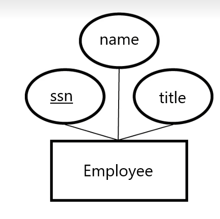
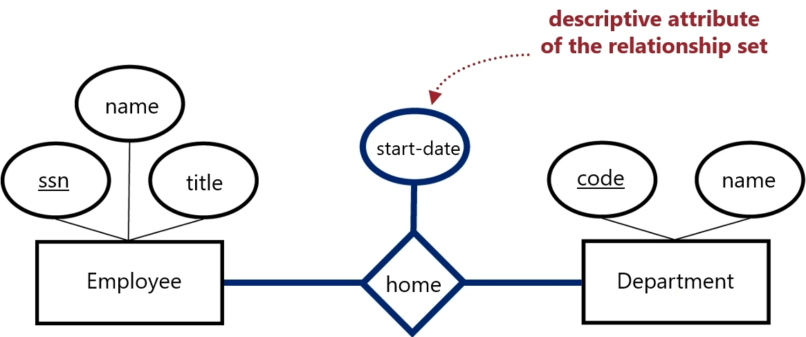
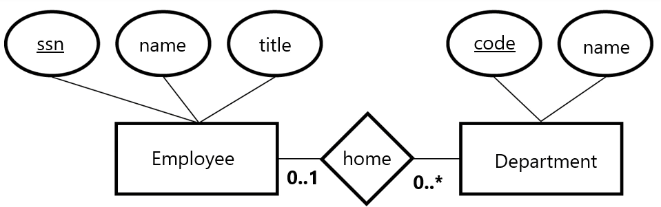
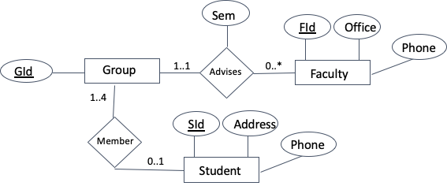
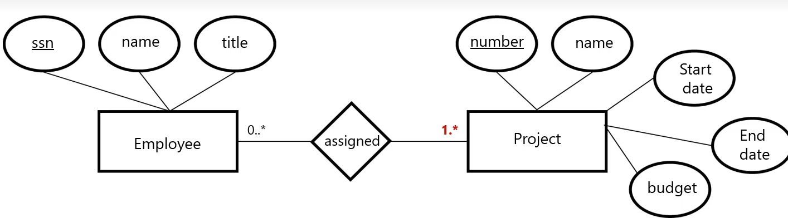
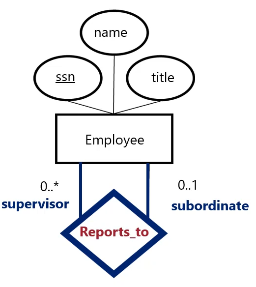
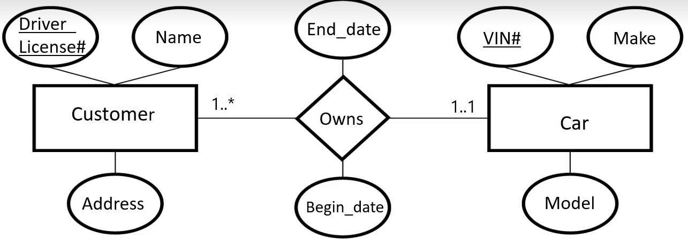
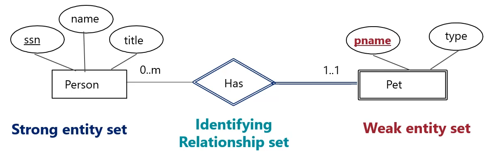

### Database Design: A 6-Step Program
1. Requirements Analysis: what data, applications, and critical operations they have
2. Conceptual Database Design: high-level description of data and constraints, *typically using an **Entity Relationship (ER)** model*
3. Logical DB design: convert the ER directly into a schema
4. Scehama Refinement: normalization (reducing redundancy and other anomalies). Tables may need to be broken into smaller tables.
5. Physical DB Design: consider workloads and sometimes modify the design, select file types, indexes and clustering of data
6. Application/Security Design


Here, we will focus on step 2, using the **Entity Relationship (ER) Diagram**.

ER diagrams are composed of distinct parts:
* **Entity**: Real-world object distinguishable from othert objects. They are described using a set of ***attributes***.
* **Entity Set**: A collection of similar entities, or entities of the same *type*. Think of it as a table. 
	* Often referred to as "entity", which blurs the distinction between type and collection\

The following depicts an entity and its 3 attributes:

They key attributes are underlined.

* **Relationship**: Association between 2 or more entities
	* e.g., an employee may have a 'home' department, where both employee and department are individual entities.
* **Relationship Set**: Named collection of similar relationships. If entity sets are nounds, think of relationship sets as verbs.

A relationship may also have descriptive attributes, shown hgere as the 'start-date' of the department becoming the employee's home department:


**Types of Relationships**
* **Many-many**
	* E.g. Takes between Students and Courses
* **Many-one**
	* E.g. Supervises between Supervisor and Employee
* **One-one**
	* E.g. Married between two People
* **"Mandatory Participation"**
	* E.g. Every student must be advided, have an advisor

**Carindality Constraints** describe the relationships between entities by annotating the edges connecting the entities to the relationship:

An employee can have either 0 or 1 home department (**0..1**), but a department can have any number of employees in it (0..*), e.g. a *many-to-one relationship*

### Translating ER Diagrams to Relations
1. Translate each entity set to a relation, with their respective attributes and key(s)
2. Model many-many relationships using tables and foreign keys
3. Model many-one relationships by including a foreign key in the entity set that references another (e.g., an employee has a home department, each employee has 1 department so we just need to add the name/ID of that department to the Employee relation)
	a. We can also model many-one relationships by making a separate table. This would require a join to pull the relations with names.
4. Model one-one relationships by including a foreign key in one of the entity sets. *Which should we do?* We try to avoid NULL values, so we pick the relation where every item is related to another in the other relation (i.e. cardinality constraint 1..1).
	a. We can also model one-one relationships by making a separate table. This is also frowned upon, as it adds an extra join.
	
	
**Example:**

This ER diagram translates into the following relational model:
`Student(SId, Address, Phone, GId)`
`Faculty(FId, Office, Phone)`
`Group(GId, FId, Sem)`

**When can Foreign Keys be Null?**
When participation is *not mandatory*, i.e. the cardinality constraint has a lower bound of 0, the foreign key can be null.
When participation *is mandatory*, i.e. the cardinality constraint has a lower bound of >0, we can specify that the foreigtn key cannot be null with the `NOT NULL` command.

We can use **assertions** to check that constraints are satisfied, i.e. if each Project must have a number in assigned, it will check that there is no number in Project that is not also in assigned. Such a case occurs during a many-many relationship where one relation has a lower bound of 0, and the other has a lower bound of 1:

```
CREATE ASSERTION inAssigned
CHECK (NOT EXISTS
				(SELECT *
				 FROM Project
				 WHERE number NOT IN
				 	(SELECT number
					  FROM assigned)))
```

**Role Names**
The same entity set may participate multiple times in a relationship set, i.e. the Employee relation which has a many-one relation with itself via the attribute Reports_to. These multiple participations are distinct **roles**.

We could make Reports_to its own table:
```
Employee(ssn, name, title)
...
Reports_to(subordinate, supervisor)
subordinate FOREIGN KEY REFERENCES Employee (ssn),
supervisor FOREIGN KEY REFERENCES Employee (ssn)
```
We could also include the `supervisor` attribute in the `Employee` relation, but this could be null as not every employee needs to have a supervisor (0..1).

**Exercise: Translate the following into a relational schema:**

Answer:
```
Customer(Driver_License#, Name, Address)
Car(VIN, Model, Driver_License#, Begin_date, End_date)
	Driver_License#, Begin_date, End_date NOT NULL
	FOREIGN KEY (Driver_License#) REFERENCES Customer(Driver_License#)
```
We must use a `NOT NULL` constraint to ensure that the cardinality is conserved (1..1), i.e. every customer owns a car

### Weak Entity Sets 
**Weak entity sets** keys are defined by a relationship with another "strong" entity set. Here is an example:

The Pet relation cannot be uniquely identified by its name and type, as it is very likely that 2 people will have a pet of the same type and with the same name. Therefore, it is a *weak entity set* related to the *strong entity set* Person via the *identifying relationship set* Has.
We indicate a weak entity set using double lines, as well as the identifying relationship set.
* A weak entity set *must* participate in the identifying relationship set
* We must include the key from the strong entity set in the weak entity set. **Both of these will be the key for the weak entity set**.

### Class Hierarchies
* A **subclass** inherits all attributes of its superclass, and may include additional attributes.
* **OVERLAP CONSTRAINT** ensures that an instance of one relation cannot also be an instance of another relation in the hierarchy.
* **COVERING CONSTRAINT**: Every entity in the superclass must be in some subclass, not some intermediate or undefined class.


**Translating Class Hierarchies to Relations**
* One approach is to use **disjoint tables**, i.e. each subclass gets its own table
	* This is best when there is some **OVERLAP CONSTRAINT**, as we then will not have to report the same entity in multiple tables.
	* This is also best when there is some **COVER CONSTRAINT**,  as we then can ensure that we are capturing all entities in full.
* Another approach is to use **disjoint attributes**, where each subclass includes the attributes *specific to that class, in addition to the key of the superclass*.
	* This is best when the subclasses may overlap, or when they do NOT cover the superclass.