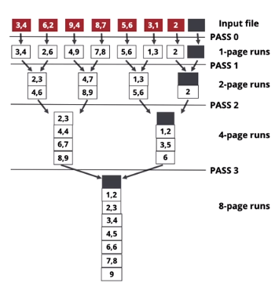

* How do you sort a relation that is larger than memory? "External Merge Sort" - using multiple passes over the relation

## External Merge Sort
* **Pass 0**: Read a page, sort it, and write it in sorted form. This process is repeated for each data page. **We only need 1 buffer to do this**.
* **Pass 1, 2, etc.**: Scan two sorted runs, merge then into a run that is twice as large. Scan over each run (runs can be more than 1 page)
	* Requires a minimum of 3 buffer pages
* Number of passes = $\lceil\log_2 N\rceil + 1$
* Total cost = $2N(\lceil\log_2 N\rceil + 1)$

We can use more than 3 buffer pages:
* To sort a file with $N$ pages using $B$ buffer pages
* Number of passes = $1+\lceil\log_{B-1}(\lceil N/B\rceil)\rceil$
* Total cost = $2N * \text{number of passes}$

In general, you can sort N pages using B memory pages in 2 passes if $\sqrt{N}<=B

