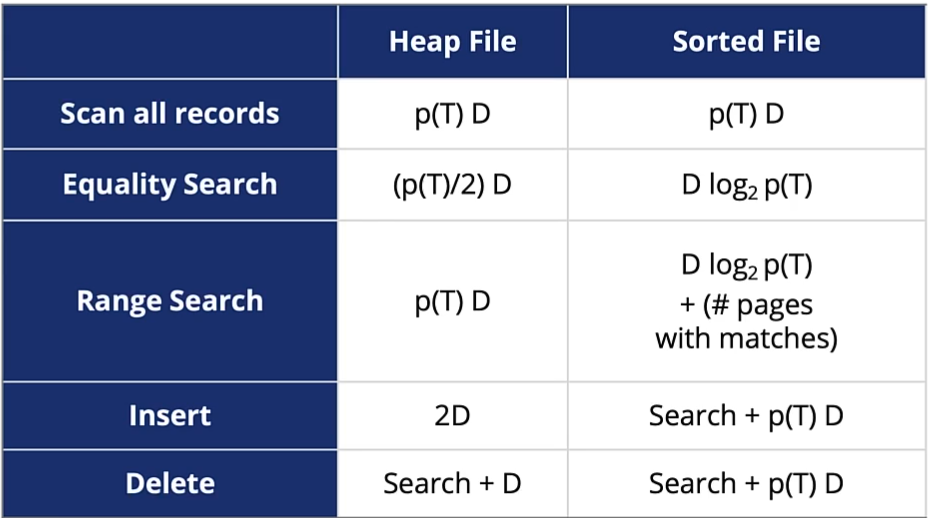

* The DDL for a table says how many bytes $B$ a tuple requires (sum of size of each attribute)
	* We will assume fixed size tuples
	* "Typical" tuple size: a few hundred up to 1,000 bytes

* A page has a fixed size (number of bytes), $N$. This dictates how many tuples can be stored on the page ($\lfloor N/B \rfloor$).
	* Tuples cannot be split between pages.
	* Typical page size for DBMS is 8K

### Alternatives for organizing files
Several alternatives, each ideal for some situation, and poor for others
* **Heap files**
	* Data unordered, default file organization
* **Sorted files**
	* Need *external sort* to sort initially and an *index* to keep sorted
* **Paritioned files** (if database engine supports it)
	* Data is mapped to partitions using a partitioning function (e.g. modulus, sets of ranges, value lists)

*Note: the comparison cost of key-values is not counted, just the number of page accesses in the below examples*

### Heap example
Cost to find a record: $O(p(T)$, where $p(T)$ is the total number of pages in table $T$
Cost to insert: we insert wherever there if free space, so 1 to read and 1 to write.
Cost of deleteing: Cost to find the record, plus the cost of updating the page with the delete bit set: $O(p(T))$

### Sorted File example
* The records are sorted using external sorting\\

Cost to find a record: using a binary search, $O(\text{log}_2p(T))$
Cost to insert: find, then insert and rearrange blocks downstream if not space on block where inserted: $O(p(T))$
Cost of deleting: find, the reorganize the file (all downstream pages): $O(p(T))$

### Operations on Data
We consider the following operations on data:
* **Scanning T**: reading all tuples in T
* **Equality search**: finding tuple(s) matching a "key" value
* **Range search**: finding tuples matching a range of "key" values
* **Insert/delete** a tuple 

#### Approximate Cost of Operations

