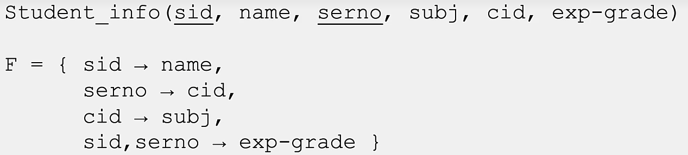

Recall: A **Candidate Key** is a set of attributes K for a relational schema R given a set of functional dependencies F if **K -> R** and K is minimal
* i.e., there is no subset X of K which is also a key
* **K --> R** may not be in F, but must be provable from F using Armstrong's Axioms. We need a set of attributes that can uninquely map to all tuples in the relation.'


### Finding Candidate Keys
* there are two steps to finding the candidate keys for R given a set of fuynctional dependencies F:
	* Finding the subsets K of R
	* Verifying that K is a key
* In general, you must look at all possible subsets of R with the following caveats:
	* Any attribute that is never on the right hand side of an FD *must be in any candidate key*
	* Once you have found a candidate key K, you never have to look at supersets of K (*minimality condition*).
* **So, start with an initial set X of attributes that are not on the right hand side of an FD, and consider increasingly large supersets until you find candidate keys**
	* In the case this method fails, i.e. each attribute shows up on the rhs of an FD, compute the closure for each attribute, and if none are equal to R, do it for each pair, etc.

**Example:** Here we are given a schema and a set of functional dependencies:

* Two attributes never appear on the right hand side of a functional dependency: **sid** and **serno**. 
* We can verify that **{sid, serno}** is a candidate key using Armstrong's Axioms -

**Proving that {sid, serno} is a candidate key for R by showing that they functionally determine all of the attributes:**
Call the functional dependencies in the given set **F1**, **F2**, **F3**, **F4**.
* By augmentation of **F1** by serno: **sid, serno --> name, serno** (**F5**)
* By augmentation of **F2** by sid: **sid, serno --> sid, cid** (**F6**)
* By transitivity of **F2** and **F3**: **serno --> subj** (**F7**)
* By augmentation of **F7** by sid: **sid, serno --> sid, subj** (**F8**)
* By union of **F4**, **F5**, **F6**, and **F8**: **sid, serno --> sid, serno, name, subj, cid, exp-grade**, we do this because they all have the same left hand side, which is **sid, serno**.

### Testing if X is a candidate key using Attribute Closure
* The **closure of an attribute set X**, denoted $X^+$, is the set of all attributes that are derivable from X using F and Angstrom's Axioms
* Given a set of attributes X and a set of functional dependencies F, we can test if X is a candidate key for R by asking if $X^+=R$ and checking that X is minimal.

**Algorithm to compute the closure of X given F**:
```
closure := X;
Mark all FD U --> V in F as unused;
repeat until no change to closure {
	if there is an unused FD U --> V in F 
	such that U is in closure then add V 
	to closure and mark U --> V as used
}
```
The first step, where we mark the closure as the set of attributes X, is an act of **reflexivity**. The step inside the loop is an application of **decomposition** and **union**.