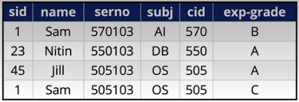

### Schema Refinement
When we create relations from ER diagrams, there are times when the tables will need to be **decomposed** into smaller relations. These decomposed relations will them somtimes have to be decomposed themselves. Sometimes, we need to recombine these decomposed tables, giving rise to the exprwession "*normalize until it hurts, recombine until it works*".

### Functional Dependencies
Some attributes are "determined by" other attributes, that is, each unique instance of one attribute is always related to a unique instance of another attribute. Take this relation for instance:

The functional dependencies can be written as such:
**sid --> name**, whenever two tuples have the same sid, they have the same name
**cid --> subj**, whenever two tuples have the same cid, they have the same subj
**sid, serno --> exp-grade**, whenever two tuples have the same sid and serno, they have the same exp-grade.
Functional dependencies are **semantic assertions** made by the designer of the DB.

A Functional Dependency is a generalization of a key: If attribute set X functionally determines set Y, written **X --> Y**, then if two tuples agree on the vales for attributes in X, they must agree on the values for attributes in Y.
So, we could write a key K for a relational schema R as **K --> R**.
This means that keys functionally determine all other attributes in the schema, including the key attributes!

**Functional deoendencies can refer to the same set as long as the key is different! I.e., a2 and a3 can both refer to (b2,c2), but a2 cannot refer to (b2,c2) twice.**