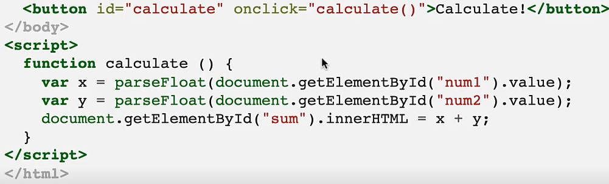

### HTML
*Hypertext Markup Lamguage*
* Describes structure of web page
* Consists opf a series of elements, which tell the browser how to render content
* Elements are identified by tags, which come in pairs, i.e. `<p></p>`

### CSS
*Cascading Style Sheets*
* Describes how the elements in an HTML document should be displayed
* "Linked" to an HTML document by including :
`<link rel="stylesheet" href="file.css">`
within the HTML `<head>` tags.

### JavaScript (JS)
* High-level programming lamguage for the web
* Creates dynamic/responsive webpages
* Runs inside a host environment such as a web browser or a server-side JavaScript runtime such as Node.js
* Libraries/frameworks extend base language ("Vanilla JS")

One can write JS *in-line* with HTML by including the JS code between two `<script>` tags. 

The `onclick` parameter allows us to define the JS function that will be called when the button is clicked.
The resulting value from the addition is stored in the `<span>` tag, as defined by `document.getElementById("sum").innerHTML = x + y;`

#### JavaScript Objects 
JavaScript Objects are stored in JavaScript Object Notation (JSON). They are defined as a set of key-value pairs:
```
var myObj = {
	"name":"John",
	"age":30,
	"cars":{ // Value can be another JSON object
		"car1":"Ford",
		"car2":"BMW"
	}
}
```
We can access the attributes of the objects in these ways:
```
myObj.name; //"John", dot notation
myObj["age"]; // 30, bracket notation
myObj["cars"]["car2"]; // "BMW"
```

#### JavaScript Functions
* Arrow Functions
An arrow separates the function parameters from the function body:
```
var double = x => x + x; // Could be called via double(2);
var average = (x, y) => (x + y) / 2;
average(1,3) // evaluates to 2
```
* Non-arrow functions (using function keyword):
```
function double(x) {
	return x + x;
}
var average = function(x,y) {return (x + y)/2};
```
JS functions are objects, and can thus be passed as arguments to functions.

### String Concatenation and Dynamic Queries
* In JS, SQL queries are represented as JS Strings
* Often want to create a query 'templates' which use runtime vaalues of variables
```
var course = document.querySelector("#course")
var name = document.querySelector("#name")
var queryAsString = "SELECT * FROM Enrollment WHERE cid='"+course+"' AND name='"+name+"';";
```

#### Template Literals
* Recommended rethod for creating dynamic queries in JavaScript
	* Improves readability, especially for long/complex queries
* Syntax:
	* Enclosed by back ticks (`)
	* Special placehodlers `${}` execute arbitrary JS expressions within the curly braces, allowing access to variables in the script
```
var queryAsTemplateLiteral = `
	SELECT *
	FROM Enrollment
	WHERE cid='${course}' AND name='${name}';
`;
```