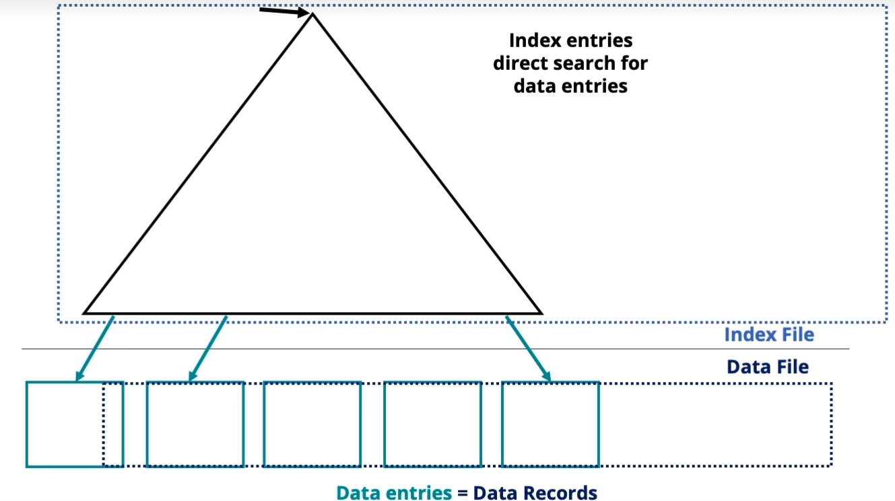
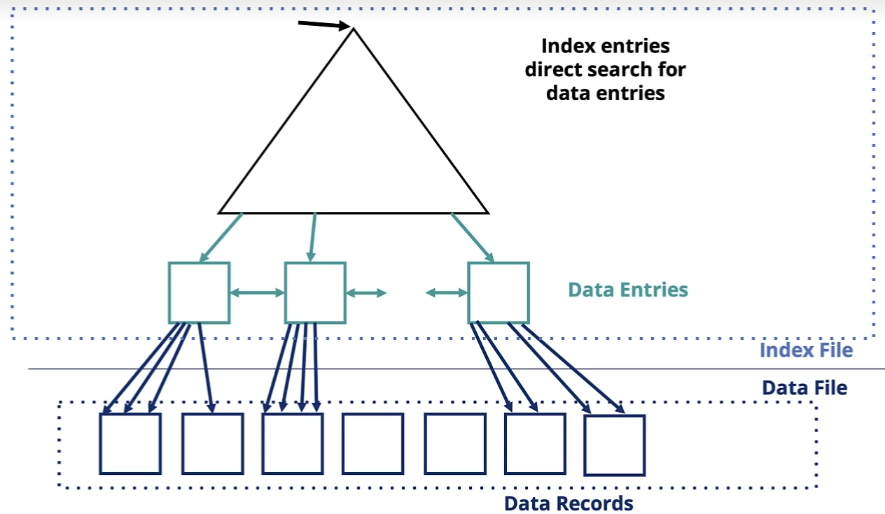

An **index** is a data structure that speeds up selections on the search key field(s)
An index transforms a search key $k$ into a data entry $k$*. Given $K$*, you can get to the record(s) with the search key $k$ in one I/O.

* You can build an index over *any subset* of the attributes iof a table
```
CREATE INDEX index_name
ON Table(attrib1, attrib2, ...)
```
* You can also build *more than one* index for the same table

### Alternatives for data entry $k$*
Data entry $K$* can be:
* Data record with key valye $k$
* list of RIDs of data records with search key $k$
	* RID = Record ID: location in file strictire

The choice of alternative for data entries os orthogonal to the indexing technique used to locate data entries with a given key value $k$

#### Data record with key value $k$
The data file is at the leaves of the tree; *there is no dereferencing*

* When you specify the PRIMARY KEY for a relation, this type of index is typically created (this can be overidden)
* This means the file organization is typically sorted on the primary key
#### Alternative 2 Index 

* You can specify other indexes using DDL syntax `CREATE INDEX ...`, which use this alternative
* A UNIQUE index ensures that there is a single RID for each key

### Classes of Indexes
* **Primary Index**: An index over the primary key
* **Secondary index**: crteated by the DBA on other lists of attributes via `UNIQUE` or `CREATE INDEX`
* **Clustered index**: order of records and index are the same
	* A primary index is typicallyclustered by default (DBA can specify `UNCLUSTERED`)
	* The DBA can create a CLUSTERED secondary index, however, there can be at most one CLUSTERED index
	* Work well on range searches
		* However, both clustered and unclustered indexes retreieve data in sorted order
	* A file can have any number of unclustered indexes
* A file can have at most one single-attribute clustered index - any other single-attribute indices must be unclustered
* NOTE: If all attributes that are needed foe the query are in the data *entry* (NOT data record, i.e. Alternative 2), the data record need not be read

***
Recall: there are two major types of indexes:
* Tree index (B+ trees)
* Hash-based indexes - Introduced as a file organization technique, good for equality selection

### Hash-based indexes
I Index is a collection of ***buckets***
* **Bucket** - *primary range* plus zero or more *overflow pages*
* Buckets contain data entries, which can use alternatives 1, 2, or 3
* ***Hashing function $h$*** : $h(r)$ = bucket in which (data entry for) record r belongs. **h** looks at the ***search key*** fields of **r**.

**When does a hash index match a query?**
* An index matches a condition if it can be used to retrieve just the pages on which there are tuples that satisfy the condition
	* **Hash indexes** operate on this principle with *equality* operations, i.e. there is a term of form *attr=val* for each attributes in the index's search key.
		* If there is an equality followed by another operator, that second operator can operate on the retrieved tuples
	* **Tree indexes** can have any kind of comparison operator (=,>,<), and not all attributes in the search key need to be in the condition

### Indexes in Practice
* B+ Trees in Practice:
	* Typical order: 100
	* Typical fill-factor: 67%
		* Therefore, average fanout = 133
	* Typical capacities:
		* Height 4: $133^4$ = 312,899,700 records
		* Height 3: $133^3$ = 2,352,637 recordss
	* Can often hold top levels of tree in buffer pool:
		* Level 1 = 1 page = 8KB
		* Level 2 = 133 pages = 1MB
		* Level 3 = 17,689 pages = 133MB
		* Level 4 = 2,352,637 pages = 18GB
	* "Nearly O(1) access time to data for equality or range queries

#### Bulk-loading B+ Trees
* Given a set of data entries over which to build a new B+ tree index, it is too time consuming to enter them one by one, instead, they are **bulk loaded**.
	* **Initialization**: Sort all data entries
	* Fill the root as much as possible, and then continue adding entries to the rightmost index page until full, then split

#### Hashing in practice
* **Dynamic hashing** (a.k.a. **extendable hashing**) allows buckets to be added and removed dnamically.
	* The hash function is designed to produce a large number of values, but only a few are used initially.
	* The hash index has a **global depth** value to signify how many bits are currently being used for computing a hash function; each bucket also has a **local depth** value which is always <= the global depth
	* When a bucket becomes full, the local depth value is increaed by 1.
	* If the local depth value is now >global depth, the gloval depth is increased by 1 and twice the number of buckets are allocated

### Costs of an Index
* Space to store the index
* Updates to the search key will be slower
* The optimizer will take lomger because it has more choices
* 