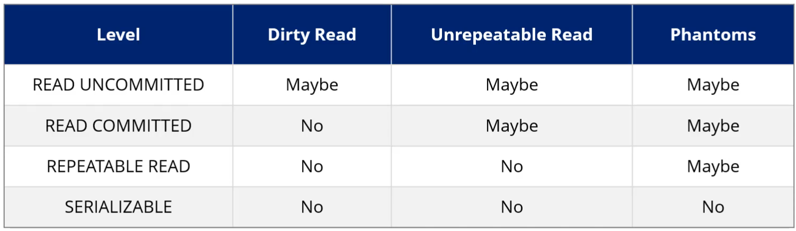

* SQL allows the user to specify isolation levels which say what undesirable phenomena a transaction can tolerate. In order from most to least stringent:
	* **SERIALIZABLE**: complete isolation
	* **REPEATABLE READ**: allows phantom reads
		* Default for MySQL
	* **READ COMMITTED**: allows unrepeatbable reads, phantom reads
		* Most typical in DBMSs
	* **READ UNCOMMITTED**: allows dirty reads, unrepeatable reads, phantom reads
		* Limited to read-only transactions
		* Typically used for historical data or aggregates where an exact amount is not necessary

The default isolation level is set by the DBA, or can be specified using:
```
SET TRANSACTION
ISOLATION LEVEL SERIALIZABLE;
```

To signal to the system that a **dirty read** is acceptable:
```
SET TRANSACTION READ ONLY
ISOLATION LEVEL READ UNCOMMITTED;
```

* General rules of thumb:
	* For performance, we generally want to specify the most relaxes isolation level that is acceptable
	* SERIALIZABLE is the most expensive
	* Experts say to use 1-2 isolation levels at most in an application



### Locking Isolation Levels
* **READ UNCOMMITTED** allows queries in the transaction to read data without acquiring any (shared) locks
	* Transactions must be read-only, no updates are allowed
	* These transactions are not well-formed
* **READ COMMITTED** requires a shared lock be obtained for all tuples touched by queries, but releases shared locks early (immediately after the read) - ***even if the transaction reads/writes again!***
	* Exclusive locks must be obtained for updates and held to end of transaction
* **REPEATABLE READ** places shared locks on tuples recieved by queries, *and holds shared locks until the end of the transaction*
	* Exclusive locks must be obtained for updates and *held to end of transaction*
	* String locking for both reads and updates
* **SERIALIZABLE** places shared locks on tuples recieved by queries as well as locks on the index, and holds them until the end of the transaction
	* Exclusive locks must be obtained for updates and held to end of transaction
	* Strict locking for both reads and updates AND locks on index