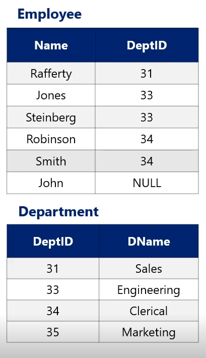
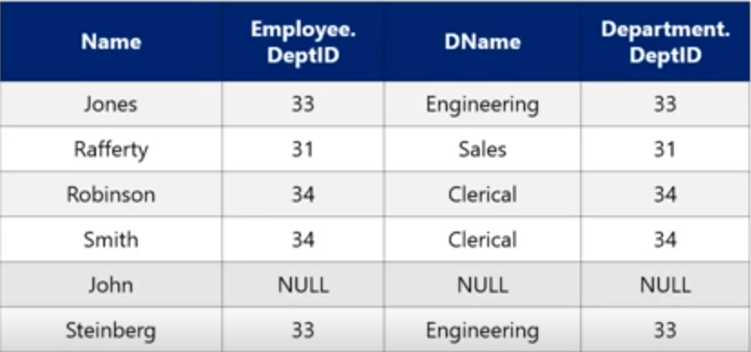
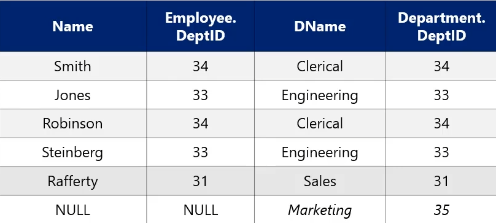
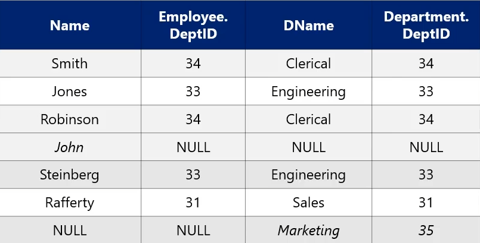

### Cross Product
The cross product of two relations, denoted with an X, is *every tuple in relation 1* combined with *every tuple in relation 2*.
The *arity* of the cross product is the *sum* of the individual arities from the component relations.
If relation 1 has n1 tuples and relation 2 has n2 tuples, the *cardinality* of the resulting relation is $n1 \times n2$.

### Equijion
The equijion between two relations is written with the bowtie symbol ($\bowtie$), with the attribute condition specified as a subscript. 
This is an example of an equijion:
```
SELECT *
FROM Employee emp JOIN Department dept 
	ON emp.DeptID = dept.DeptID
```
This is eqivalently written in relational algebra as:
$$\textbf{Employee}\bowtie_{Employee.DeptID=Department.DeptID}\textbf{Department}$$
In general, the upper bound size limit for a join on a key-foreign key relation is the cardinality of the table with the foreign key.
If we are not imposing any kind of key/foreign key constraints, the join cardinality can be anywhere from 0 to as large as their cross product.

### Natural Join
A natural join ius a shorthand that considers the schema of the relations. Each attribute that is shared between both relations is used in the join. 
In the event that the schemas of the two relations are disjoint, i.e. they share not common attributes, the cross product is returned.

### Outer Joins
* Left outer join:
	* Include the left tuple even if there is no match
* Right outer join:
	* Include the right tuple even if there is no match
* Full outer join:
	* Include both the left and right tuples even if there is not match

Considering these two relations:

This query performs a left ouer join:
```
SELECT *
FROM Employee emp LEFT OUTER JOIN Department dept
	ON emp.DeptID = dept.DeptID
```
This is equivalently written in relational algebra using an equals sign to the left of the $\bowtie$:
$$\textbf{Employee=}\bowtie_{Employee.DeptID=Department.DeptID}\textbf{Department}$$
The result is:


This query performs a right outer join:
```
SELECT *
FROM Employee emp RIGHT OUTER JOIN Department dept
	ON emp.DeptID = dept.DeptID
```
This is equivalently written in relational algebra using an equals sign to the right of the $\bowtie$:
$$\textbf{Employee}\bowtie=_{Employee.DeptID=Department.DeptID}\textbf{Department}$$
The result is:


This query performs a full outer join:
```
SELECT *
FROM Employee emp FULL OUTER JOIN Department dept
	ON emp.DeptID = dept.DeptID
```
This is equivalently written in relational algebra using an equals sign on both sides of the $\bowtie$:
$$\textbf{Employee=}\bowtie=_{Employee.DeptID=Department.DeptID}\textbf{Department}$$
The result is:
