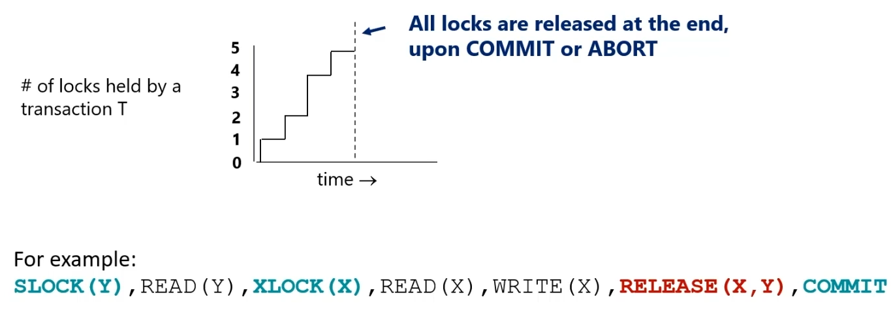
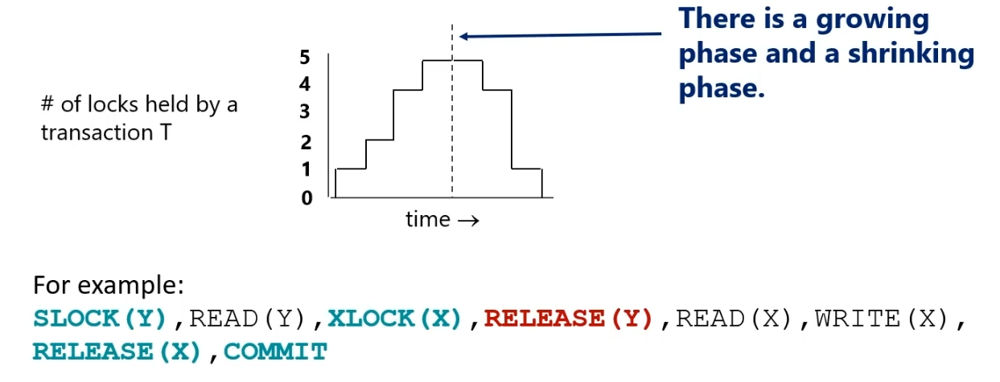

One way to manage conflicts by preventing them entirely is **locking**.
Each data item is either **locked** (in some mode, we will use **shared** (`SLOCK`) for reading and **exclusive** (`XLOCK`) for writing) or is available (**no lock**).
A transaction must acquire an appropriate lock before a data item is accessed (this makes a **well-formed transaction**)
* Before a read, at least a shared lock must be acquired (an exclusive lock will also work)
* Before a write, an exclusive lock must be acquired.

The goal of locks is how they can be used to guarantee serializability.

Locks on a data item are granted based on a **lock compatibility matrix**

So, one can request a shared lock on a data item that already has a shared lock or no lock at all and be granted, but the action will be blocked if the requestee has an exclusive lock.
If conflicting locks are never granted, we say the execution is **legal**.

Locks can be **released** via `RELEASE(X)` . 
Most DBMSs will require that locks are held until the end of the transaction, called **strict locking**. Strict locking means that the number of locks in a transaction increases, until all locks are released.

**Two-Phase Locking** (2PL) applies locks gradually as needed, and locks are released gradually. *No new lock is acquired after some lock is released.*

### Managing Deadlocks
Locking involves requests for locks being blocked until the other lock is released, which can cause **deadlocks** by causing two transactions to wait on each other to release their locks.

We can model deadlock with a **Wait-For Graph**, which is a directed graph $G(V,E)$ where vertices $V$ are active transactions and edges $E$ exist if a transaction $T_i$ requests a lock and transition $T_j$ holds a conflicting lock. **Cycles in this graph represent deadlocks**.

A **Wait-For graph** and a **Precedence graph** are similar in the sense that if there is an edge $T_1 \rightarrow T_2$ in the Wait-For graph and T1 and T2 eventually commit, then there will be an edge $T_2 \rightarrow T_1$ in the Precedence graph.

Two ways of avoiding deadlocks altogether are **WOUND-WAIT** and **WAIT-DIE**

#### WOUND-WAIT
* Give each transactions a timestamp when it begins
* The lower the timestamp, the higher the priority of the transaction (oldest transactions have highest priority)
* If $T_i$ requests a conflicting lock held by $T_j$ and has higher priority, then abort $T_j$, otherwise $T_i$ waits

### WAIT-DIE
* Give each transactions a timestamp when it begins
* The lower the timestamp, the higher the priority of the transaction (oldest transactions have highest priority)
* If $T_i$ has higher priority, it is allowed to wait. Otherwise, it is aborted