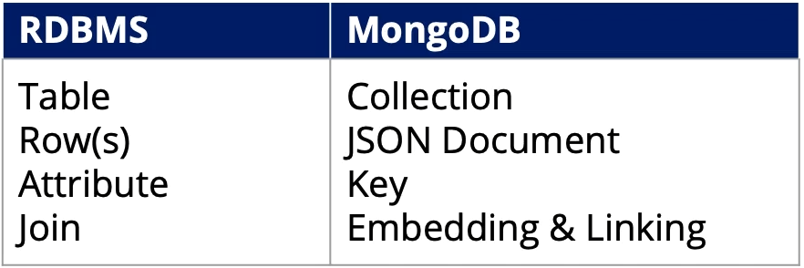

## MongoDB Data Model

* MongoDB is an example of a document-oriented (self-describing, therefore easy to read)
	* Consists of "collections" of JSON format documents

* A MongdoDB deployment hosts a number of databases
* A **Database** holds a set of collections
* A **collection** holds an array of documents
* A **document** is a set of key-value pair



* Every document must have an _id

### CRUD Operations
* **C**reate, **R**ead, **U**pdate, **D**elete
* **Insert**
```
db.collection.insertOne() # to insert 1 document
d.colelction.insertMany() # to insert more than 1 document
```
* **Delete**
	* Specify a predicate for documents to be deleted
```
db.people.deleteOne({"_id":1}) # Delete one db
db.people.deleteOne() # Treats key as a prefix
db.people.deleteMany() # deletes all docuemtns in a collection, though collection remains
```
* **Remove a collection**: `db.collection.drop()`
* **Update** documents in a collection
```
db.collection.updateMany({key:value}, {$set: {key:value}})
# Can also set new attribute
db.collection.updateMany({key:value}, {$set: {newKey:value}}) 
```

### Indexes
* A unique index is created in the _id field when the collection is created
	* This index cannot be dropped
 
* Can create additional indexes
```
db.collection.createIndex({attrivute:val}, {name:"IndexName"})
db.collection.dropIndex() # Drop an index
```

##  Simple Queries in MongoDB
* Use `db.collection.find()` function, no arguments is analagous to `SELECT *`
	* `find()` takes 2 arguments, both passed in in curly brackets (`{}`). The first is the ***selection** condition*
* Example: Return rows where the autor is Kevin and birth yeah is 1980:

	* `db.collection.find({author:"Kevin", birthyear:1980})`
 
* **Comparison operators**: `$lt`, `$lte`, `$gt`, `$gte`
	* Example: `db.collection.find({birthyear: {$gte: 1970, $lte: 1990}})`
 
* **Negation**: `$ne`
	* Example: `db.collection.find({birthyear: {$ne: 1982}})`
 
* **Disjunction**: `$or` for different attributes, `$in` for 1 attribute
	* Example of `$or`: `db.collection.find({$or: [{birthyear: 1982}, {author: "Kevin"}]})`
	* Example of `$in`: `db.collection.find({birthyear: {$in: [1980, 1985]}})`
* **Projection** (selecting columns) is the second argument to `find()`
	* Example: Select all rows and a subset of columns
		* `db.posts.find({}, {author:1, birthyear:1})`
	 
		* `_id` colummn is always returned by default. To suppress this, specify `{_id:0, ...}` in the projection argument in `find()`
	 
		* Attributes are returned *unless specifically suppressed*
	 
* **Cursor methods** include `.limit(int)` for limiting the number of rows, `.skip(int)` to skip the first 'int' rows and return the rest, and `.sort()` to specify fields sprting in ascending (1) or descending (-1) order. The size of results can be obtained with `.count()`
	* These functions are applied after `find()`, i.e. `db.collection.find(...).count()`
 
* `.pretty()` prints out each attribute on its own line

## Arrays and Embedded Documents
Can have lists, documents, and lists o documents as entries into a relation.
* Elements of an array or *ordered*
	* This can be overcome with `$all:`, i.e. `d..collection.find({attrib:{$all:["item1","item2",...]})`
	* To find documents with an array containing a single element: `db.collection.find({attrib:"item"})`
* Elements of an array can be (zero) indexed via `"attrib.0"`
* This size of an array can be checked via `$size`, i.e. `db.collection.find({attrib: {$size: 3}})`
	* To test inequalities on the size, use `$where`, i.e. `db.collection.find({$where:'this.attrib.length>3'})`
		* `this` refers to the current document
	 
* To test that *at least one* array element satisfies (a list of) condition(s): `db.collection.find({dim_cm:{$elemMatch:{$gt: 22, $lt: 30}}})`

## Joins
The use of joins is not encouraged in MongoDB, in fact, the mantra is "join on write, not on reads". To achieve this, documents are **embedded**, i.e. the information is repeated for each document, violating 3NF and BCNF.