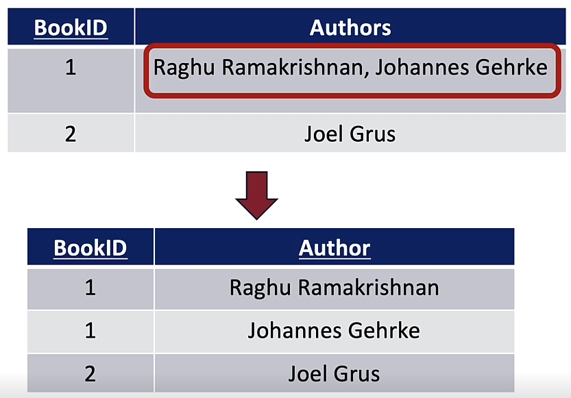

### First Normal Form (1NF)
* A relation is in **First Normal Form** (1NF) if all attributes are atomic, that is, *no lists or records*.
	* For example, if a relation of BookID and Authors could have multiple values in the Authors attribute, we normalize this by making a separate tuple for each distinct author

Strictly speaking, Author is "atomic", but it could be useful to split into first/last name attributes if we will be querying first/last named often.

### Third Normal Form (3NF)
* A relation is in **Third Normal Form** (3NF) if it is in 1NF and for every **X --> A** in F either:
	* A $\isin$ X (it is trivial) or
	* X is a superkey for R (superkey = non-strict superset of key) or
	* A is a member of some key for R

### Decomposiiton into Third Normal Form
In the event that a table is not in third normal form, i.e. for some functional dependency the lhs is not a superkey or the rhs is not a member of some key, we can decompose the table into a set of relations wach of which are in third normal form.
Each of the decomposed relations have their key calculated as the lhs of the FD that they were created from

### Boyce-Codd Normal Form (BCNF)
Every relation that is in BCNF is also in 3NF and 1NF.
* A relation R is in **Boyce-Codd normal Form** (BCNF) if for every X $\rightarrow$ Y in F either
	* Y is a subset of X (i.e. X$\rightarrow$Y is "trivial")
	* X contains a key for R (X is a "superkey")

### When is a decomposition "good"?
* It is **lossless** - doesn't lose the connections between tuples
	* Formally: R1, ..., Rk is a losless join decomposition of R w.r.t. an DF set F for every instance r of R that satisfies F, projecting r over each Ri and then joining the resulting instances together gives back the original instance r
		* Always required
* It preserves dependencies
	* Not always possible for BCNF
	* There is always a 3NF decomposition which can guarantee both lossless and depedency preservation