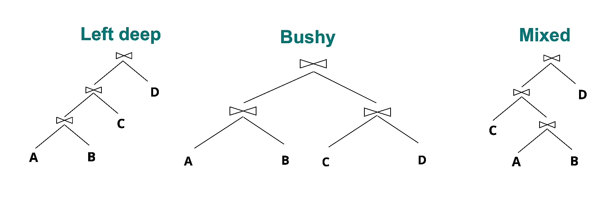

Hown can the system find an effective query plan for a given query?
* Based on the estimated cost of the query plan
* Two main issues in optimization:
	* For a given query, which plans are considered?
	* How is the cost of a plan estimated?

1. What clans are considered
* Typically, some subspace of plans are considered

* Left-deep trees generate all **fully pipelined plans**
	* This means that intermediate results are not written to temporary files
	* Not all left-deep trees are fully pipelined (i.e. Sort Merge join)

2. Estimating the cost of a plan
* The system maintains statistics about the relations, such as:
	* Size of tuples
	* Cardinality
	* Distribution of data values in the columns
	* Indexes
* At each point in a query plan, the number of tows returned is estimated based on these statistics
	* The statistics can become stale
* The total cost is a function of the estimatec cost at each point in the query plan