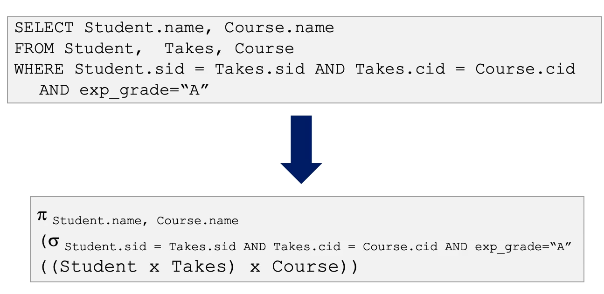

## Projection: $\Pi_\alpha$
* Given a list of column names $\alpha$ and a relation $R$, $\pi_\alpha (R)$ extracts the columns in $\alpha$ from $R$.

*	Note that duplicates are excluded in relational algebra, but this is not the case for SQL (DISTINCT must be used)
*	Corresponds to SELECT

## Selection: $\sigma_\theta$
* Given a predicate $\theta$, $\sigma_\theta(R)$ selects the tuples from $R$ that match $\theta$
* Example: $\sigma_{\text{exp-grade="B"}}\text{Takes}$ would returnm any tuple in Takes that has exp-grade equal to "B".
* There will mever be duplicates in the output
* Corresponds to WHERE

## Cartesian Product: $\times$
* $R_1\times R_2$ concatenates every tuple in $R_1$ with every tuple in $R_2$
* The size of the result is alwaus the product of the size of the two input relations

* Corresponds to FROM

## Join: $\bowtie_\theta$
* Products are hardly ever used alone, they are tpyicallu used in conjunction with a selection
* $R_1\bowtie_\theta R_2$ concatenates a tuple $x$ in $R_1$ with a tuple $y$ in $R_2$ if $(x,y)$ satisfies $\theta$

* Columns that are shared between relations being joined will be disambiguated using :1, :2, etc.
* Correspionds to JOIN .. ON

Always evaluate expressions from the outside in!

## Relational Algebra Equivalences: Query Rewriting Rules
For simple SQL expressions (do not involve GROUP BY, HAVING, IN/NOT IN, EXISTS/NOT EXISTS, or the set operations), *there is an immediate translation into RA*:
* First, the product of the relations in the FROM clause is taken
* Then, the condition in the WHERE clause is used as a selection condition ($\sigma_\theta$)
* Finally, the attribute of the SELECT cause form the list of attributes in a projection ($\pi_\alpha$)
* Example:

However, this immediate translation may not be the best way of executing the query

#### Relational Algebra Equivalencies
The RA Equivalencies allow us to choose different join orders and to "push" selections and projections ahead of joins, and guarantee an equivalent expression
* **Selections**: 
$\sigma_{{\{c_1\land...\land c_n\}}}\equiv\sigma_{c1}(...\sigma_{cn}(R)...)$ *Cascade*
	$\sigma_{c1}(\sigma_{c2}(R))\equiv\sigma_{c2}(\sigma_{c1}(R))$ *Commute*
	*Disjucts* can be turned into unions, i.e. $\sigma_{B=3\lor B=5}R\equiv(\sigma_{B=3}R)\cup(\sigma_{B=5}R)$
	
* **Projections**:
$\Pi_{a1}(R)\equiv\Pi_{a1}(... \Pi_{\{a1,...,an\}}(R)...)$ *Cascade*
*This will allow as few attributes to be kept in intermediate results as possible*

* **Joins**:
$R\bowtie(S\bowtie T)\equiv(R\bowtie S)\bowtie T$ *Associative*
$R\bowtie S\equiv S\bowtie R$ *Commutatuve*
*Relations can be in any order with joins*

* A projection commutes with a selection which only uses attributes retained by the projection

* Selection between attributes of the two arguments of a cartesian product converts cartesian product to a join

* A selection on the attributes of a single relation commutes with join:

* If a projection follows a join $R\bowtie S$, we can "push" the projection by retaining only attributes that are needed for the join or are kept by the projection
