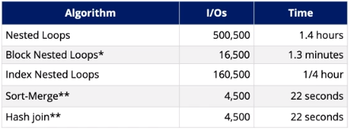

1. Sort $R$ on join attributre if necessary
2. Sort $S$ on join attribute if necessary
3. **Merge R and S**:
```
current(R) = first tuple in R
current(S) = first tuple in S
while (more tuples in R and S)
	while current(R) < current(S)
		advance current(R) to next tuple in R
	while current(S) < current(R)
		advance current(S) to next tuple in S
	if current(R) = current(S)
		output all pars of tuples in R, S with this key
			update current(R), current(S) to the next key value
```

* $R$ is scanned once, *each $S_i$ group is scanned once per matching $R$ tuple.* If the matching group is small, then matching is in memory. However, if the matching group $S_i$ cannot all fit in memory, then $S_i$ may need to be read multiple times.
* In the best case, the merge can be done in one scan of $R$ and $S$, with cost: 

$\text{Cost to sort} R + \text{Cost to sort } S + (M+N)\text{assuming all matches fit in memory}$

* In the worst case, all of the key values are the same, thus the matching group is the entire relation for $R$ and $S$. the cost is:

$\text{Cost to sort R} + \text{Cost to sort} S + (M\times N)$

### Comparison to Hash Join
* Given a minimum amount of memory, both have a cost of $3\times(M+N)$ I/Os (i.e. $M<B^2$ and $N<B^2$)
* Hash Join is superior if relation sizes differ greatly; hash join is also highly parallelizable
* Sort-merge join is less sensitive to data skew, and the result is sorted

# Comparison of Join Strategies

*Assuming 35 page buffers
**Assuming number of pages $P$ per file satisfies $\sqrt{P}<B$