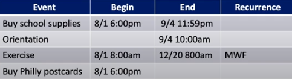

This course **integrates** computer science concepts:
* Languages, data structures, concurrency. These ideas are all pulled together to solve a problem *larger than main memory*.

#### Defining a Database
A **database** is a collection of *data items* (facts) stored <u>systematically and permanantly</u> in a computer so that *programs* can consult it to answer questions. The answers to those questions become *information* that can be used to make decisions that may not be made with the data elements alone.
* How does this differ from variables used in a program? **Permamance!** variables only exist during the execution of a program, data in a database persists.
* How does this differ from an input file to a program? **Structure and random access!** We can access any item in the database, but a file must be read from the beginning to be properly understood.

The 'facts' in a database may be structured in a number of ways known as **database models** managed by a **database management system (DBMS)**, and queried using a **query language**.
* Early DBMSs (1960s) used a *hierarchical database model* or *network database model*, using looping constructs that were close to programming languages
* Many current systems use the *relational database model* (1970s), which arrange facts into sets of values which satisfy *logical predicates*. *SQL* is the "standard" language, and is declaritive.
* More recent *NoSQL* systems use document-oriented models, key value stores, or graph models, and have languages influenced by relational languages.

Suppose we are designing a calendaring application. Each of tthe 'facts' in this application would be events, and each event would be of a different nature, i.e. recurring appointments, to-dos, one-time appointments, etc. Each of these could be modeled in a distinct way:
