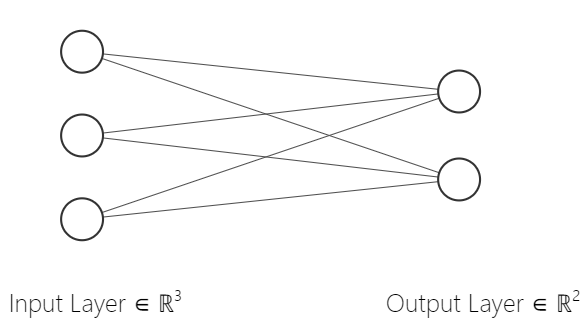
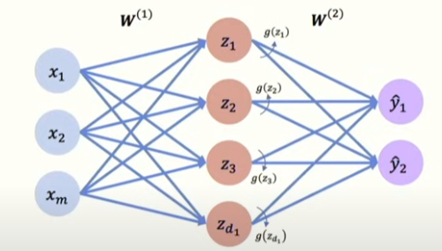

*Following [this MIT series](https://www.youtube.com/watch?v=ErnWZxJovaM&list=PLtBw6njQRU-rwp5__7C0oIVt26ZgjG9NI)*
### The Perceptron: Forward Propogation

A perceptron takes in $m$ inputs $X_1,...,X_m$. Each input is multiplied by the *edge*'s corresponding *weight* and *ummed* (a *weighted linear combination*). This weighted linear combination is then fed through a (nonlinear) *activation function* $g$, which produces the output $\hat{y}$ 
$$\hat{y}=g(\sum_{i=1}^mx_iw_i)$$
A *bias* term is typically included, which allows the model to 'shift' the neuron's output by adding some constant $w_0$. The completed expression, with the bias term, would be
$$\hat{y}=g(w_0+\sum_{i=1}^mx_iw_i)$$
This written in matrix notation is
$$\hat{y}=g(w_0+\textbf{X}^T\textbf{W})$$
where $\textbf{X}^T\textbf{W}$ is the *dot product* between the input $\textbf{X}$ and the (learned) weight vector $\textbf{W}$.
#### Activation Functions
One commonly used activation function is there *sigmoid function*:
$$\sigma(z)=\frac{1}{1+e^{-z}}$$
because it takes any real input $z$ and squashes the output to between $0$ and $1$, making it a good choice for building a model that will learn probabilities.

#### Common Activation Functions
Here are some commonly used activation functions, and their derivatives, which are used in *backpropogation*
* Sigmoid function

$$g(z)=\frac{1}{1+e^{-z}}$$
$$g'(z)=g(z)(1-g(z))$$
* Hyperbolic tangent

$$g(z)=\frac{e^z-e^{-z}}{e^z+e^{-z}}$$
$$g'(z)=1-g(z)^2$$
* Rectified Linear Unit (ReLU)

$$g(z)=\text{max}(0,z)$$
$$g'(z)=\begin{cases}1, \text{if } z>0\\ \text{else }0\end{cases}$$ 

### Multi-output Perceptron
We can stack neorons in the output layer that each have their own set of weights. Because all inputs are densely connected to all outputs, these layers are called **Dense layers**.

To write the calculation occuring *at each neuron in this layer*:
$$z_i=w_{0,i}+\sum_{j=1}^mx_jw_{j,i}$$
Such a dense layer can be implemented in Tensorflow as:
```
import tensorflow as tf
layer = tf.keras.layers.Dense(units=2) # Where 'units' is the number of neurons in the layer, in this case equivalent to the number of neurons in the output layer.
```
That is, the output is the bias term plus the weighted sum of the inputs, as previously described. This is then of course passed through some *activation function* to achieve nonlinearity.

### Single Layer Neural Network
Here we have **hidden layers**, which are called as such since we do not directly observe/supervise its values. The operation performed in the hidden layer is the same: a dot product between (rows of) weight matrices and inputs $x_j$.

So we now have two weights matrices, $\textbf{W}^{(1)}$ and $\textbf{W}^{(2)}$. The final output of the network can be written as:
$$\hat{y}_i=g(w_{0,i}^{(2)}+\sum_{j=1}^{d_1}g(z_j)w_{j,i}^{(2)})$$
where $g(z_j)$ is the $j$-th result of the input layer, passed through an activation function $g$.

The weights of each connection obviously need to be initialized in some way. Given an input and a random set of weights, a neural network will most likely not make an accurate prediction on the given input. So, we need to **train** our neural network with examples of input and output data.
### Loss Functions
We can measure the difference in our models output versus the actual output of a data point using a **loss function** (also called *objective function*, *cost function*, and *empirical risk*).
To accurately measure the empirical loss, we will average the loss over all training inputs:
$$J(W)=\frac{1}{n}\sum_{i=1}^nL(f(x^{(i)};\textbf{W}),y^{(i)})$$
that is, we average all losses computed between our model's prediction $f(x^{(i)};\textbf{W})$ and the true label $y^{(i)}$.
When learning a probability distribution, such as a binary classification problem, a good choice of loss function is the **Binary Cross Entropy Loss**:
$$J(W)=-\frac{1}{n}\sum_{i=1}^ny^{(i)}\log(f(x^{(i)};\textbf{W}))+(1-y^{(i)})\log(1-f(x^{(i)};\textbf{W}))$$
```
import tensorflow as tf
loss = tf.reduce_mean(tf.nn.softmax_cross_entropy_with_logits(y, preds))
# reduce_mean() is just used to get the mean of a tensor
```

**Mean Squared Error** loss can be used with regression models that have continuous real output:
$$J(W)=\frac{1}{n}\sum_{i=1}^n(y^{(i)}-f(x^{(i)};,\textbf{W}))^2$$
```
import tensorflow as tf
loss = tf.reduce_mean(tf.square(tf.subtract(y, preds)))
# or...
loss = tf.keras.losses.MSE(y, preds)
```

### Loss Optimization (Training)
We want to find the network with the weights that *achieve the **lowest loss***:
$$\textbf{W}^*=\text{arg min}\frac{1}{n}\sum_{i=1}^nL(f(x^{(i)}\textbf{W}),y^{(i)})$$
Out loss is a function of the network weights, so it is easy to visualize the *loss landscape*; we want to find *minima* in this loss landscape. 
This very naturally gives rise to the **gradient descent** algorithm, in which we compute the *gradient* of the loss landscape and 'step', or update our weights, such that we are moving opposite of the gradient with respect to the loss. 
**Gradient Descent Algorithm**
1. Initialize weights randomly, i.e. according to some probability distribution
2. Loop until convergence:
	1. Compute gradient $\frac{\partial J(\textbf{W})}{\partial\textbf{W}}$
	2. Update the weights, $\textbf{W}=\textbf{W}-\nu\frac{\partial J(\textbf{W})}{\partial\textbf{W}}$
3. Return the weights
```
import tensorflow as tf

weights = tf.Variable([tf.random.normal()])
while True:
	with tf.GradientTape() as g:
		loss = compute_loss(weights) # whatever loss function we want to use
		gradient = g.gradient(loss, weights)
	weights = weights - lr * gradient
```

Next: Backpropogation https://www.youtube.com/watch?v=tIeHLnjs5U8