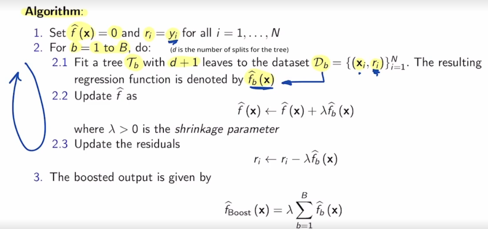
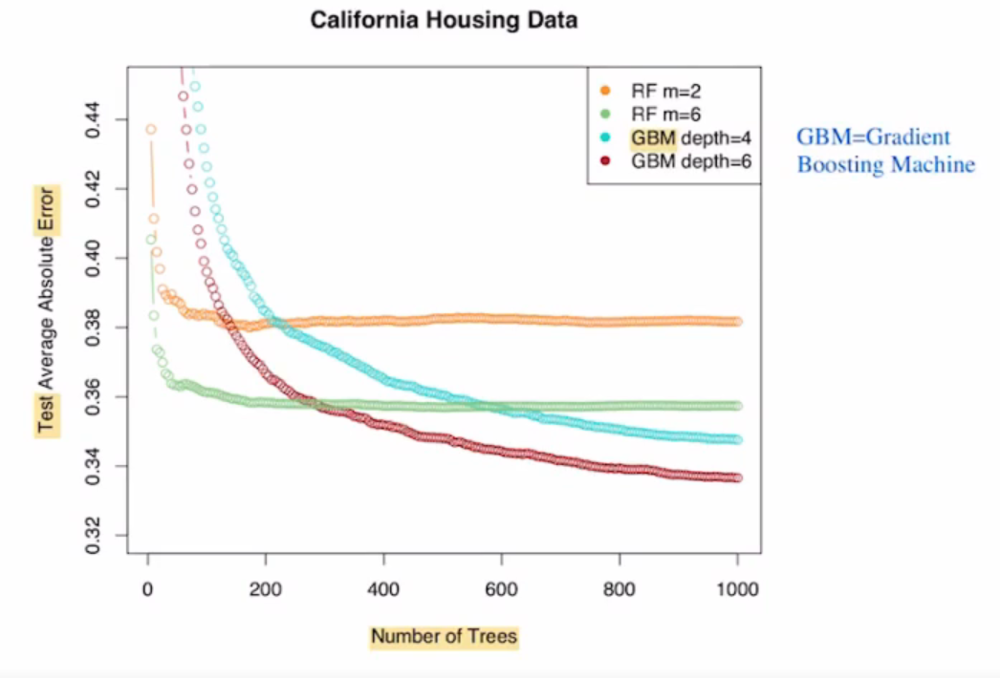

## Ensemble Techniques
Consider $N$ random variables $Y_1,...,Y_n$ with zero mean (**ZERO MEAN INDICATES THAT THE VARIANCE OF A RANDOM VARIABLE $X$ IS EQUAL TO $E[X^2]$**), equal variances $\sigma^2$ and constant covariance $E[Y_iY_j]=\rho$ for $i\ne j$. The variance of the mean satisfies
$$Var[\bar{Y}]=Var[\frac{1}{N}\sum_{i=1}^{N}Y_i]=\frac{1}{N^2}E[(\sum_{i=1}^{N}Y_i)^2]$$
We expand the squared summation to the sum of squares plus the covariance. (*Remember the covariance is nothing but the sum of dot products*)
$$=\frac{1}{N^2}E[\sum_{i=1}^{N}Y_i^2+\sum_{i\ne j}Y_iY_j]$$
By the **linearity of expectation** we know that the expectation of a sum is the sum of the expectations:
$$=\frac{1}{N^2}\sum_{i=1}^{N}E[Y_i^2]+\frac{1}{N^2}\sum_{i,j}E[Y_iY_j]$$
Since mean is $0$, and eliminating the summations:
$$=\frac{\sigma^2}{N}+\frac{N(N-1)}{N^2}\rho$$
And as $N$ grows large:
$$\approx \frac{\sigma^2}{N}+\rho$$

### Main Idea in the context of Trees
Generate a collection of random estimates $\hat{Y}_b$ for $b=1,...,B$ and use the mean as an output to reduce variance. In particular, **bootstrap aggregation** follows these steps:
1. Given a training dataset $D_{\text{Tr}}$, generate $B$ different bootstrap samples 
2. For each bootstrap sample, train a tree with many leaves without pruning. Denote $\hat{y}_b(\bf{x})$ as the regression function for tree $T_b$
3. The output of the bootstrtap aggregation is the empirical average of these regression functions, i.e. $\hat{y}_{BA}(\bf{x})\frac{1}{B}\sum_{b=1}^B\hat{y}_b(\bf{x})$

In step 2, we generate many tall trees, which tend to have a large variance. However. the variance overall is reduced by averaging the regression functions.

### Out-of-Bag Test Error Estimation
1. Roughly 1/3 of the samples in our training dataset are not contained in a bootstrap sample - these are called *out-of-bag* observations
2. Consequently, any given sample from the training dataset is nopt present in roughly 1/3 of the bootstrap samples.
3. Hense, we can estimate the test error of the $i$-th sampe as the average MSE over all the out-of-bag samples/observations. In other words, we compute the MSE for the $i$-th sample using those trees for which the $i$-th sample has not been used in their training. 

This same idea can be adapted to classification problems.

### Boosting
*Boosting* is a general technique that can be applied to many regression and classification techniques, but here we limit to regression trees.
In **boosting**, we create a collection of trees sequentially, using information from each orevious tree to grow the current tree.

In the for-loop, **we fit the tree using the residuals, not the outputs**, then add a scaled version of the regression function to update the residuals.
* The trees typically have a small number of leaves (2/3 work well)
* Boosting can lead to overfitting if $B$ is too large
* The shrinkage parameter is typically small (0.01, 0.001)
* We learn sequentially and slowly *to avoid potential overfitting*. In fact, we *never overfit* with boosting, or any ensembl technique - our testing error will never increase.

