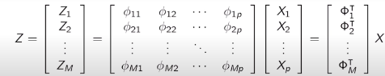
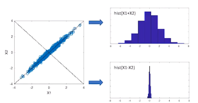

### Recap: Covariance 
The **covariance** of two random variables $X_r$ and $X_s$ is defined as:
$$\sigma_{rs} = E[(X_r-\mu_r)(X_s-\mu_s)]$$
where $E[X]_k=\mu_k$.
Equivalently, the covariance matrix $\Sigma_X$ of a random vector $X=[X_1,X_2,...,X_p]^T$ is defined entry-wise as $[\Sigma_X]=\sigma_{rs}$. To rewirte the above in matrix notation, it is:
$$\Sigma_x=E[(X-\mu_X)(X-\mu_X)^T]\isin\mathbb{R}^{p\times p}$$
with $\mu_X=E[X]\isin\mathbb{R}^p$.
For $E[X]=0$, we have $\Sigma_X=E[XX^T]$
* * *
## Principal Component Regression
**Problem Statement**: Generate $M<p$ artificial inputs using linerar combinations of the original $p$ inputs.
* Consider a linear model with p input variables; $Y=\beta_0+\beta_1X_1+...+\beta_pX_p+\epsilon$
* Find $M < p$ artificial input variables $Z_1,...,Z_m$ related to the original variables via linear combinations: $Z_m = \phi_{m1}X_1+\phi_{m2}X_2+...+\phi_{mp}X_p$ for $m=1,...,M$.
* Hence, the artificial and original inputs are related via this linear transformation (recall matrices are linear transformers of vectors):

* Then, with this reduced set of $M$ artificial variables, we would like to perform a linear regression.

How do we choose the transformations $\theta_m$ to achieve good performance? **We choose combinations aiming to maximize the variance of the artificial variables.** The idea is that more variance yields more information within the variable. For example, when determining a linear combination for two variables $X_1$ and $X_2$:

### PCR Criterion: $M=1$
**Variance of Linear Combinations**:
Assume a vector of r.v.'s $X$ and coefficients $\Phi_1^T$. What is the variance of $Z_1=\phi_{11}X_1+\phi_{12}X_2+...+\phi_{1p}X_p=\Phi_1^TX$? For simplicity assume $E[X]=0$:
$$\text{Var}[Z_1]=\text{Var}[\Phi_1^TX]=E[(\Phi_1^TX)^2]$$
$$=E[\Phi_1^TXX^T\Phi_1]=\Phi_1^TE[XX^T]\Phi_1$$
Assuming that $E[X]=0$, from the law above we can conclude:
$$=\Phi_1^T\Sigma_X\Phi_1$$
Hence, we must maximize $\text{Var}[Z_1]=\Phi_1^T\Sigma_X\Phi_1$, with the constraint that $||\Phi_1||=1$ to ensure the product does not blow up to $\infty$.
The solution to his optimization is $\Phi_1=\bf{v}_1$, where $\bf{v}_1$ is thr unit-length eigenvector of $\Sigma_X$ corresponding to its largest eigenvalue $\lambda_1$.

### PCR Criterion: $M > 1$
We must find $M$ artificial variables $Z-1,...,Z_m$ uch that the sum of their variances is maximized. Hence, we need to solve:
$$\text{max}\sum_{m=1}^M\Phi_m^T\Sigma_X\Phi_m$$
with the constraints $||\Phi_i||=1$ for all $i$ for the same reason as above, and $\Phi_i^T\Phi_j=0$ to force the vectors to explore independent directions.
The solution to this optimization is $\Phi_m=\bf{v}_m$, where $\bf{v}_m$ is the unit-length eigenvector of the cpvariance matrix $\Sigma_X$ corresponding to its $m$-th largest eigenvalue $\lambda_m$. **These vectors $\Phi_m$ are called the *principle components***.

#### PCR Algorithm
1. First, we estimate the covariance matrix $\Sigma_X$ from out dataset:
$$\Sigma_X=E[(X-\mu_X)(X-\mu_X)^T]$$
$$\hat{\Sigma}_X=\frac{1}{n}\sum_{i=1}^{n}(x_i-\hat{\mu}_x)(x_i-\hat{\mu}_x)^T$$
2. Compute the $M$ eigenvectors associated with the $M$ largest eigenvalues of $\hat{\Sigma}_X$. Denote these eigenvectors by $\bf{v_1},...,\bf{v_m}\isin\mathbb{R}^p$
3. From each $p$-dimensional datapoint, we can generate artificial inputs by applying the transformation:
$$\bf{z}_i=[\bf{v1},...,\bf{v_m}]^T\times \bf{x}_i\isin\mathbb{R}^M$$
Essentially, we are doing PCA on our data and then using the resulting features (vectors $\bf{v_m}$) to do linear regression.