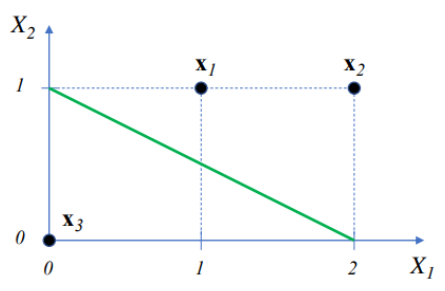
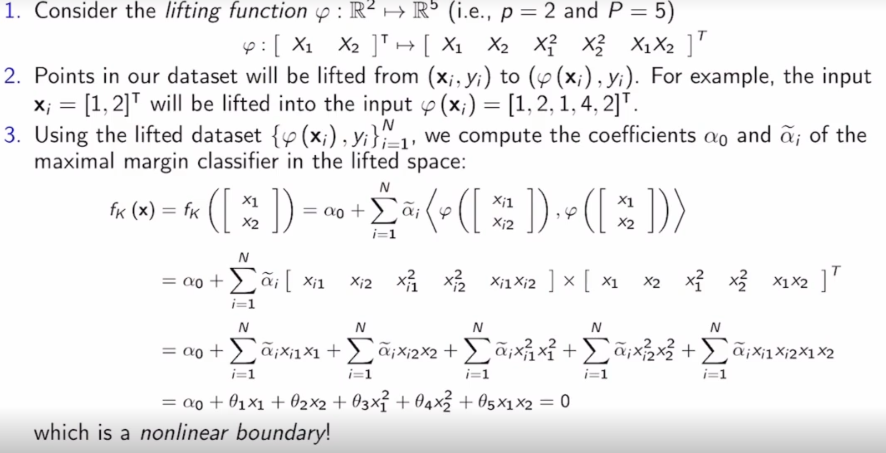

A **support vector machine (SVM)** is a type of nonlinear classifier aiming to find a separation boundary between classes.

### Linear Classifier: Formulation

In a high-dimensional problem ($p>>1$), how can we find a separating hyperplane? (in 2 dimensions a line, in 3 a plane, etc...)  
Consider the **equation of a dimension p hyperplane**:

$$
\alpha_0 + \alpha_0x_0+...+\alpha_px_p=\alpha_0+\alpha^\text{T}\textbf{x}=0
$$

If $\alpha_0=0$ thr hyperplane passes through the origin (duh.)  
Vector $\alpha$ is called the **normal vector**.  
**Half Spaces:** A hyperplane splits the space $R^p$ into two half spaces

- $\alpha_0+\alpha^\text{T}\textbf{x}>0$ defines one half space and $\alpha_0+\alpha^\text{T}\textbf{x}<0$ the other
- The hyperplane $\alpha_0+\alpha^\text{T}\textbf{x}=0$ separates the classes in the dataset if

$$
y_i\times (\alpha_0+\alpha^\text{T}\textbf{x}_i) >0
$$

for all $i=1,...,N$

- The shortest distance from a point $\textbf{x}_i$ to the hyperplane is equal to $y_i\times (\alpha_0+\alpha^\text{T}\textbf{x}_i)$ when $||\alpha||=1$

#### Example

Consider the green line as the hyperplane and the points $x_1, x_2, x_3$  
  
The equation that defines this line is:

$$
f_L(x)=-2+x_1+2x_2=0
$$

which can be rewritten as

$$
x_2=1-\frac{1}{2}x_1
$$

We assign labels $y_i\isin\{-1,1\}$ to each of the points that satisfies the inqeuality $y_i\times f_L(x)>0$. This comes out to be:

$$
y_1=1, y_2=1,y_3=-1
$$

which is verifiable.  
The shortest distance from any point to this hyperplane can be calculated as such:  
Normalizing by the 2-norm of the coefficient vector: $||\alpha||=||[1,2]^T||=\sqrt{1^2+2^2}=\sqrt{5}$ :

$$
-\frac{2}{\sqrt{5}}+\frac{x_1}{\sqrt{5}}+\frac{2x_2}{\sqrt{5}}=0
$$

Evaluating this at $\bf{x}_2$ equals the shortest distance to the hyperplane,

$$
-\frac{2}{\sqrt{5}}+\frac{2}{\sqrt{5}}+\frac{2\times1}{\sqrt{5}}=\frac{2}{\sqrt{5}}
$$

### Maximal Margin Classifier

*How do we pick a separating hyperplane when many possible hyperplanes exist?*

- A good choice is to pick the hyperplane that maximizes the **margin** M, defined as the minimum distance between any point $D$ and the hyperplane
- We can compue the maximal margin hyperplane by solving an optimization problem optimizing margin $M$ to find the hyperplane with the largest $M$.

### Support Vector Classifier (SVC)
Most datasets are not linearly separable. Therefore, we must include some flexibility to allow for a few points to be on the 'wrong' side of the linear boundary.  
A **Support Vector Classifier** is a *linear classifier* that allows a few points to be on the 'wrong' side of the separating hyperplane by providing a *slack budget C* in the optimization program.
#### Slack budget
The term $(1-\epsilon_i)$ allows point $i$ to be closer to the separating hyperplane than $M$ when $\epsilon_i>1$. For example, when $\epsilon_i=1$, the point $i$ is allowed to be exactly on the hyperplane. When points are on the wrong side of the hyperplane, $\epsilon_i>1$, when they are on the correct side but within the margin $M$ $1>\epsilon_i>0$, and when they are outside of the margin on the correct side, $\epsilon_i=0$. 
The hyperparameter $C$ represents the total budget we can spend on slack variables $\epsilon_i$, since $\sum_{i=1}^N\epsilon_i\leq C$
$C$ controls the flexibility with which the hyperplane can 'incorrectly' classify training points. **The larger $C$, the more rigid the SVC is**.  This is because, if you were to move a point at random that has $\epsilon_i>0$, it will impact the separating line less, since a change in its $\epsilon$ would not effect the overall budget $C$ as much as if $C$ were small.
**The margin $M$ is multiplied by a term $1-\epsilon_i$, the sum of the $\epsilon_i$'s is $\leq C$**. In this way, $C$ is the "budget" we can "spend" on placing points on the "wrong" side of the hyperplane.

## Support Vector Machine (SVM)

Many datasets are not separable using a hyperplane, i.e. a linear surface.  
To address this, we would like to *bend classification boundaries by adding nonlinear (polynomial, products, etc.) features.* 'Lifting' the dataset to a higher dimensional space may reveal a linearly separable space for the data.

### Nonlinear Boundaries

We can obtain a **nonlinear** boundary function $f_K(\textbf{x})$ following these steps:

1.  Lift the vector of inputs from $p$ dimensions to $P$ dimensions, where $P>p$ using a **lifting function** $\gamma$ that maps vectors in $R^p$ to vectors in $R^P$
2.  In the lifted input space $R^P$, we propose a ***linearly** separating boundary of the nonlinear features of the form* $f_K(\textbf{x})=\alpha_0+\alpha^T\gamma(\textbf{x})$
3.  The vector $\alpha$ satisfies $\alpha=\sum_{i=1}^{N}\tilde{\alpha}_i\gamma(\textbf{x}_i)$, meaning that the vector of coefficients $\alpha$ (or $\beta$ in the linear case) *is (still) simply a weighted linear combination*.
4.  Hence, the nonlinear classifier can be written as:

$$
=\alpha_0+\sum_{i=1}^{N}\tilde{\alpha}\langle \gamma(\textbf{x}_i),\gamma(\textbf{x})\rangle
$$

The $\langle x, y\rangle$ represents the dot product and is a measure of similarity between two vectors. In our case, 5we calculate the dot product/similarity between an input point $\textbf{x}$ (i.e. the point we are trying to classify) and data points $\textbf{x}_i$ in our dataset.  

### Kernel Trick

for large $N$ and $P$, computing the lifted vectors $\gamma(\textbf{x}_i)$ and $\langle \gamma(\textbf{x}_i),\gamma(\textbf{x})\rangle$ for all $i$ can be costly.  
For a certain lifting function, the inner products $\langle \gamma(\textbf{x}_i),\gamma(\textbf{x})\rangle$ can be efficiently computed using **kernel functions**; abstract extensions of inner products.

- A kernel function takes two vectors anf produces a real number measuring the similarity of these vectors. For example *polynomial* kernels are defined as:

$$
K_P(\textbf{x}_i,\textbf{x}_j)=(1+\textbf{x}_i^T\textbf{x}_j)^d
$$

- **Kernel Trick**: for each kernel function $K$, there is a lifting function $\gamma$ such that:

$$
K(\textbf{x}_i,\textbf{x}_j)=\langle \gamma(\textbf{x}_i),\gamma(\textbf{x})\rangle
$$

Hence, using kernels we can easily compute the inner product $\langle \gamma(\textbf{x}_i),\gamma(\textbf{x})\rangle$. 
*However*, to have a reliable kernel we must cleverly design the lifting function/lifted space for our feature vector.

### Kernel Example
Using the **radial bias kernel** $K_r(x_i,x)=e^{-\gamma(x-x_i)^2}$ find a nonlinear boundary $f_R(x)=\alpha_0+\sum_{i=1}^{N}\tilde{a}_ie^{-\gamma(x-x_i)^2}$ to separate points in your dataset.
This kernel is essentially the *gausian distribution* with mean $x_i$. Computing the **sum** of these bell curves will give us a general prediction curve $f_R(x)$ - points where $f_R(x)>0$ are classified as $+1$, while points that are $f_R(x)<0$ are classified as $-1$.

### SVMs with more than 2 classes
### One-Versus-All
Consider a dataset $D$ with $K$ classes, e.g. $y_i\in\{1,2,...,K\}$.

**OVA Algorithm**:
1. For $k=1,...,K$:
	a. Build the dataset $D_k^{OVA}=\{(x_i,y_i^{OVA})\}^N_{i=1}$ where $y_i^{OVA}=1$ for $y_i=k$ and $y_i^{OVA}$ for $y_i\ne k$ -- i.e. points in class $k$ are one class and the rest of the $K-1$ classes are merged into another 'negative' class.
	b. Find a separation boundary $f_k^{OVA}=0$ separating the two classes in $D_k^{OVA}$. The associated classifier is $C_k^{OVA}(\textbf{x})=1$ if $f_k^{OVA}(\textbf{x})\geq0$, $-1$ otherwise.
2. Classify a point $\textbf{x}$ using this formula:
$$C^{OVA}(\textbf{x})=\text{arg max} \ f_k^{OVA}(\textbf{x})$$
, meaning we classify point $\textbf{x}$ according to the largest value of the classification function over all $k$ classes, that is, the decision boundary from which it is furthest.

This method is called one-versus-all because, obviously, it handles the multi-class problem by taking each class individually and classifying it as a 'positive' class, while all other classes get treated as the 'negative' class.

### One-Versus-One
Consider a dataset $D$ with $K$ classes, e.g. $y_i\in\{1,2,...,K\}$.
**OVO Algorithm**:
1. For all pairs of classes $k_1, k_2$ (i.e. we have a double for-loop):
	a. Build the dataset such that only points in classes $k_1$ and $k_2$ are present.
	b. Find a boundary $f_{k_1k_2}(\textbf{x})=0$ separating the two classes. The associated classifier is $C_{k_1k_2}^{OVO}=+1$ if $f_{k_1k_2}(\textbf{x})\geq0$, $-1$ otherwise.
2. Classify a point $\textbf{x}$ to the class that 'wins' the most pairwise comparisons, i.e.
$$C^{OVO}(\textbf{x})=\text{arg max}\sum_{k_2=1}^K\text{sign}[C^{OVO}_{k_1k_2}(\textbf{x})]$$
where we maximize over class $k_1$.
$K\choose{2}$ comparisons overall will be made when doing OVO.