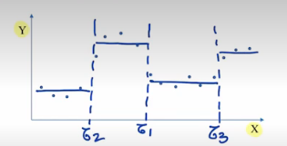

**Tree-based methods** are a group of techniques for *nonlinear* regression and classification

**Main Ideas** 
* Segment the input space into rectangular regions
* In each region, our regression / classification estimate is constant
* The segmentation of the input space can be codified using a binary tree
* Trees allow for simple interpretation of regression / classification rules (*understandable ML*)
\a
**Toy example**: 
Consider a simple regression problem where $p$ (num. of dimensions / input features) is equal to $1$:

At each $x$ we pick a boundary $\tau_i$ and predict some constant (i.e. mean) within those boundaries. This is esentially using a piece-wise constant (PWC) function to approximate the output of $Y$. **We can encode a PWC as a binary tree.**

****
### Recursive Splitting
In the case of $p=2$, we will select vertical and horizontal positions that segment the data into rectangular regions. *The predictions ($\hat{y}$) in each partition are the averages of the true $Y$ values, i.e. an unweighted linear combination.*
We can select boundaries of these regions for each variable (up to $p$), by comparing the two regions that it creates (compare their residuals, i.e. the RSSs). The boundary with the lowest RSS will be selected. Then, within each of these determined regions, revursively partition them into two regions, repeat until the RSS stops decreasing.

****

### Pruning a Tree
A large regression tree with many leaves is ver flexible and can lead to overfitting, inducing a *poor test MSE*.

**Pruning technique**: Follow these steps:
1. Grow a tree using the recursive binary splitting algorithm, adding leaves one by one. Keep track of the trees created in the process and call the tree $\Tau_l$ with $l$ leaves
2. Stop when all regions have less than a small number $n_t$ of samples. The resulting tree will have a large number $L$ of leaves and is likely overfitting.
3. For the trees in the set $\{T_l\}^L_{l=1}$, use cross validation to estimate their *test MSE*
4. Choose the tree for whichthe estimated test MSE is minimized.

Essentially, we build a tree to some minimum level and then check the test MSE of all subtrees within it.
As always, the test MSE will decrease and then increase once the tree begins overfitting. The train RSS or MSE will always monotonically decrease.

****

### Classification Trees
We can adapt the idea of regression trees to the case of categorical outputs musing *classification trees*:

**Regression tree**:
* Quantitative outputs
* Each region should contain points of similar output
* The predicted value of an input is the *average output in its region*

**Classification Tree**:
* Catergorical outputs
* Each region should contiain points of the same category
* The predicted category of an input is the majority class in its region

#### Cassification Trees - Algorithm
Grown using the same recursive binary splitting algorithm used in regresison trees. **Main Diffrerence** is that instead of RSS, we use a measure adapted to classification - obvious choice is classification error rate/
* For a point $\bf{x}\isin R_j$, the output of the classifier is given by
$$C(\bf{x_i})=\text{argmax }\hat{p}_{jk}$$
where $\hat{p}_{jk}$ is the fraction of points of class $k$ in region $R_j$, maximizing over all $k$ classes.
* The ***misclassification rate*** of the tree is given by
$$\text{Err}_{\text{Tree}}=\frac{1}{N}\sum_{j=1}^J|R_j|(1-\text{max }\hat{p}_{jk})$$
, once again maximizing over all $k$ classes.
**Numerical issue:** The misclassification rate doesn not behave well numerically in the tree-growing process.

##### Gini Index
$$\text{Gini}_{\text{Tree}}=\frac{1}{N}\sum_{j=1}^{J}|R_j|\sum_{k=1}^{K}\hat{p}_{jk}(1-\hat{p}_{jk})$$
* Measure of class purity within each region. A small value indicates the region contains mostly observations of the same class.
##### Cross-Entropy
$$D_{\text{Tree}}=-\frac{1}{N}\sum_{j=1}^{J}|R_j|\sum_{k=1}^{K}\hat{p}_{jk}\text{log}(\hat{p}_{jk})$$
* Also measures class purity in each region.

##### Advantages of Trees:
 * Explainable / Interpretable (as opposed to black-box)
 * Approproate for hman decision making
 * Can handle a mixture of predictors without the need for dummy variables
 ##### Issue with Trees
 * Trees do not have competitive performance, and lack behind other classification methods. **Solution**: Tree performance can be boosted by aggregating many trees using ensemble techniques
* ****
### Ensemble Trees
The performance of trees can be boosted by aggregating many trees (i.e. ensemble methods).
* **Boostrap aggregation** (also known as *bagging*) aims to redice the variance of learning methods
* **Random forests** improve on bagging to further reduce variance of tree-based methods
* **Boosting** is a general technique where we generate an ensemble of trees sequentially, using information from previous trees in the sequence.

### Random Forests
*Bootstrap aggregation* is able to reduce the test error by reducing the variance of the predicted output thought averaging. However, the bootstrapped samples used in bagging can be strongly correlated, and hence the resulting trees and predictors are also strongly correlated, wwhich limits how much the variance can be reduced.
**Random Forests** aim to further reduce the variance of our prediction by generating en ensemble of trees that are less correlated. **Variance between trees does not depend on the number of trees in the forest**.
**Pruning** a tree is equivalent to a method of **regularization**, making the model more *rigid*.
To generate a random forest, we can use a random subset of the features in our training dataset. Typically, the number of inputs $m$, where $m<p$, is chosen to be approximately $\sqrt{p}$. This will result in less correlated trees than obtained in bagging.

### Variable Importance Measure
We can measure the importance of an input variable $X_i$ in bagging and random forests as follows:
**In regression probems**: Record the total amount that the RSS is reduced due to splits over a particular input $X_i$, averaged over all $B$ trees. The larger this value, the more important the input.
**In classification problems**: Record the total amount that the **Gini Index** (or whatever loss you're using to build your trees) is reduced due to splits over a particular input $X_i$, averaged over all trees.